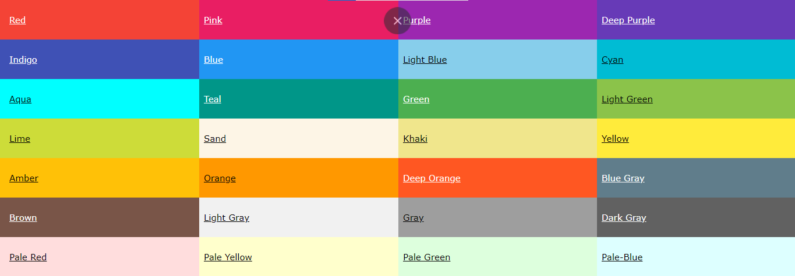
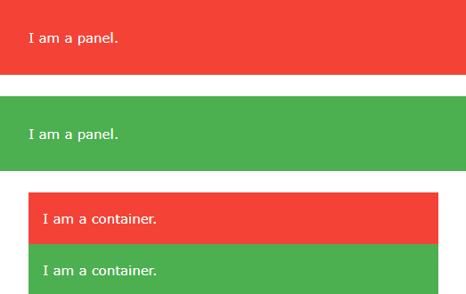
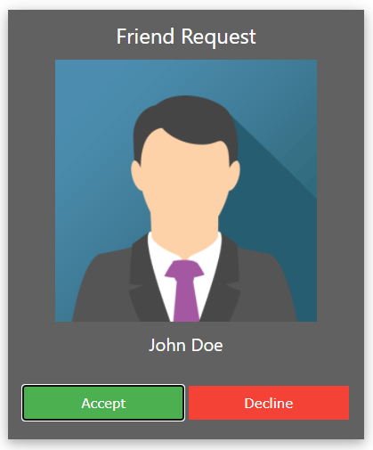
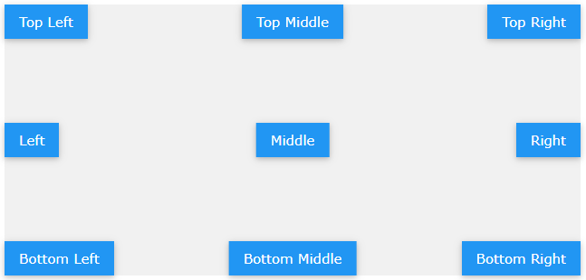
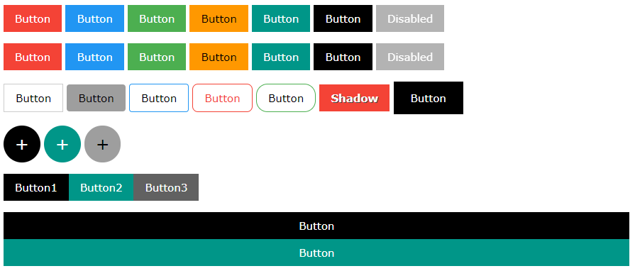

# W3.CSS

* W3.CSS is a CSS framework with support for desktop, tablet and mobile design. It's smaller and faster than similar frameworks.

* It was designed to be a high quality alternative to Bootstrap, designed to be smaller, faster and easier to learn and use.

* It was also designed to be independent of jQuery or any other JavaScript library.


To use W3.CSS in your web site, download [W3.CSS](https://www.w3schools.com/w3css/w3css_downloads.asp) or just add a link:

```html
<link rel="stylesheet" href="https://www.w3schools.com/w3css/4/w3.css">
```

Here are some [example templates](https://www.w3schools.com/w3css/w3css_templates.asp).

---

[TOC]

---


## 1. Colors

The color scheme is inspired by *Material Design Colors* (used in marketing and sticky notes).




#### Coloring HTML elements

`w3-color`: background color for any HTML element.

`w3-text-color`: text color.

`w3-hover-color`: define the background hover color.

`w3-hover-text-color`: define the text hover color.


## 2. Containers

The `w3-container` adds 16px left and right padding. It's the perfect class to use with container elements as `<div>`, `<article>`, `<section>`, `<header>`, `<form>` and more.

It provides equality for all HTML container elements, giving common margins, paddings, alignments, fonts and colors. It can be used to style `<header>` and `<footer>` elements.

Although `w3-container` doesn't provide top and bottom padding, it won't be necessary because the content will have it's own margin which will simulate the padding.


## 3. Panels

The `w3-panel` adds a 16px top/bottom margin, and a left/right padding. 

It's perfect for displaying notes, alerts, info cards, quotes...




#### Close (hide) a panel


````html
<div class="w3-panel w3-display-container">
	<span onclick=" this.parentElement.style.display='none' "
          class="w3-button w3-display-topright">X</span>
	<p>Click on the X to close this panel.</p>
</div>
````


#### Open (show) a panel

````html
<button class="w3-btn" onclick="document.getElementById('id01').style.display='block'">Show panel</button>

<div id="id01" class="w3-panel w3-green w3-display-container" style="display:none">
	<span onclick="this.parentElement.style.display='none'"
          class="w3-button w3-display-topright">X</span>
	<p>Click on the X to close this panel.</p>
</div>
````


## 4. Borders

| Class                   | Defines                                  |
| ----------------------- | ---------------------------------------- |
| w3-border               | Adds borders (top, right, bottom, left)  |
| w3-border-top           | Adds top border                          |
| w3-border-right         | Adds right border                        |
| w3-border-bottom        | Adds bottom border                       |
| w3-border-left          | Adds left border                         |
| w3-border-0             | Removes all borders                      |
| w3-border-*color*       | Displays the border in a specified color |
| w3-hover-border-*color* | Adds hoverable border color              |
| w3-bottombar            | Adds thick bottom border                 |
| w3-leftbar              | Adds thick left border                   |
| w3-rightbar             | Adds thick right border                  |
| w3-topbar               | Adds thick top border                    |


## 5. Cards

For displaying paper-like cards:

* `w3-card`: Container for content.

* `w3-card-2`: 2px bordered shadow.
* ``w3-card-4`: 4px bordered shadow.


You can add `w3-color` to cards for colored cards.

Example of a card with header and footer inside the card container:

```html
<div class="w3-card-4">
	<header class="w3-container w3-blue"> <h1>Title</h1> </header>
	<div class="w3-container"> <p>Text...</p> </div>
    <footer class="w3-container w3-blue"> <h5>Footer</h5> </footer>
</div>
```


#### Photo cards

Displaying images with a description in cards.

````html
<div class="w3-card-4">
	
	<div class="w3-container w3-center"> <p>Photo text</p> </div>
</div>
````


#### Hover effect

`w3-hover-shadow` adds a effect on any element to make it look like a ``w3-card-4`.

````html
<div class="w3-green w3-hover-shadow w3-center">
	<p>Hover over me!</p>
</div>
````


#### Example of complex card



````html
<div class="w3-card-4 w3-dark-grey">
	<div class="w3-container w3-center">
      <h3>Friend request</h3>
      
      <h5>John Doe</h5>
      <button class="w3-button w3-green">Accept</button>
      <button class="w3-button w3-red">Decline</button>
	</div>
</div>
````


## 6. Fonts

Easy to read: W3.CSS pages are easy to read even for people with slight reading disabilities..

* default font-size 15px
* default font family Verdana, which has a good letter spacing
* default line-spacing 1.5 is also very good


**Headings**: font-size on px

`<h1>36</h1>`, `<h2>30</h2>`, `<h3>24</h3>`, `<h4>20</h5>`, `<h5>18</h5>`, `<h6>16</h6>`.


#### Font-size classes

`w3-tiny`, `w3-small`, `w3-medium`, `w3-large`, `w3-xlarge`, `w3-xxlarge`, `w3-xxxlarge`, `w3-jumbo`.


#### Font-family

To change the default Verdana font-family:

````css
.w3-myfont {
  font-family: "Comic Sans MS", cursive, sans-serif;
}
````

````html
<body>
	<p class="w3-myfont">Making the Web!</p>
</body>
````


#### External fonts

````html
<link rel="stylesheet" href="https://fonts.googleapis.com/css?family=Tangerine">
<style>
    .w3-tangerine { font-family: 'Tangerine', serif; }
</style>
````

And on the body use the created class `w3-tangerine` (or font name).


## 7. Text

* Text alignment: `w3-left-align`, `w3-right-align` and `w3-center`.
* Text expanded: `w3-wide`. 
* Text opacity: `w3-opacity`. Designed to work with all background colors.
* Text shadow: `<h2 style='text-shadow: 1px 1px 0 #444'>Text</h2>`.


## 8. Round Classes

| Class                       | Defines             |
| --------------------------- | ------------------- |
| `w3-round`                  | border-radius: 4px  |
| `w3-round-small`            | border-radius: 2px  |
| `w3-round-medium` (default) | border-radius: 4px  |
| `w3-round-large`            | border-radius: 8px  |
| `w3-round-xlarge`           | border-radius: 16px |
| `w3-round-xxlarge`          | border-radius: 32px |


#### Circle class

* `w3-circle`: Displays content inside a circle.


## 9. Padding

| Class         | Defines                 |
| ------------- | ----------------------- |
| w3-padding-16 | 16px top/bottom padding |
| w3-padding-24 | 24px top/bottom padding |
| w3-padding-32 | 32px top/bottom padding |
| w3-padding-48 | 48px top/bottom padding |
| w3-padding-64 | 64px top/bottom padding |


**Padding Size Classes**

| Class            | Defines                                   |
| ---------------- | ----------------------------------------- |
| w3-padding-small | 4px top/bottom + 8px right/left padding   |
| w3-padding       | 8px top/bottom + 16px right/left padding  |
| w3-padding-large | 12px top/bottom + 24px right/left padding |


## 10. Margin

| Class            | Defines                       |
| ---------------- | ----------------------------- |
| w3-margin        | 6px margin to all sides       |
| w3-margin-top    | 16px top margin to an element |
| w3-margin-right  | 16px right margin             |
| w3-margin-bottom | 16px bottom margin            |
| w3-margin-left   | 16px left margin              |
| w3-section       | 16px top/bottom margin        |


## 11. Display

Display classes allow you to display elements in specific positions inside other elements:



| Class                   | Defines                                                      |
| ----------------------- | ------------------------------------------------------------ |
| w3-display-container    | Container for w3-display-classes                             |
| w3-display-topleft      | Displays the content on the corner of the container          |
| w3-display-topright     | Displays the content on the corner of the container          |
| w3-display-bottomleft   | Displays the content on the corner of the container          |
| w3-display-bottomright  | Displays the content on the corner of the container          |
| w3-display-left         | Displays the content on the aside of the container           |
| w3-display-right        | Displays the content on the aside of the container           |
| w3-display-middle       | Displays the content on the middle of the container          |
| w3-display-topmiddle    | Displays the content on the top of the container             |
| w3-display-bottommiddle | Displays the content on the bottom of the container          |
| w3-display-position     | Displays the content at a specified position                 |
| w3-display-hover        | Displays the content on hover inside the container           |
| w3-left                 | float: left                                                  |
| w3-right                | float: right                                                 |
| w3-show                 | display: block                                               |
| w3-hide                 | display: none                                                |
| w3-mobile               | Adds mobile-first responsiveness to any element. <br>Displays elements as block elements on mobile devices.<br>Adds width: 100%; on screens less than 600px wide. |


## 12. Buttons




| Class     | Defines                                                      |
| :-------- | :----------------------------------------------------------- |
| w3-btn    | Rectangular button w/ shadow hover effect. Default color is black. |
| w3-button | Rectangular button w/ gray hover effect. Default color is inherited in v4. |
| w3-bar    | Horizontal bar, can be used to group buttons (Perfect for horizontal nav) |
| w3-block  | Define a full width (100%) button.                           |
| w3-circle | Define a circular button.                                    |
| w3-ripple | Create a ripple effect at click.                             |

Both `w3-btn` and `w3-button` add button-behavior to any elements. The most common are `<input type='button'>`, `<button>` and `<a>`.

#### Tips

* Add `w3-color` to color the buttons.
* Add `w3-hover-color` to get hover color effect.

* Add `w3-round-size` to get rounded buttons.
* Add `w3-size` to define button size.
* Add `w3-border-color` to define button borders.
* Add `w3-wide` to expand the button text.
* Add `w3-padding-size` to get extra padding.
* Add `w3-block` to get 100% width buttons.
* Add `w3-disabled` to disable a button.
* Add `w3-bar` to get a horizontal button group.
* Add `w3-bar-item` on each button inside a `w3-bar` to display buttons without margins.
* Add `w3-center` to the `w3-bar` to center the group.
* Remember all elements can act as button, even an ``.


## 13. Notes

The `w3-panel` class is perfect to display notes, info, alerts and quotes. 

Some examples:

```html
<div class="w3-panel w3-yellow">Text</div>
<div class="w3-panel w3-border w3-light-grey w3-round-large">Text</div>
<div class="w3-panel w3-pale-blue w3-leftbar w3-rightbar w3-border-blue">Text</div>
<div class="w3-panel w3-pale-red w3-leftbar w3-border-red">Text</div>
<div class="w3-panel w3-pale-yellow w3-border w3-border-yellow">Text</div>
```


Standard HTML symbols to build quotes with `w3-panel`.

| Symbol | Code   |
| :----- | :----- |
| ≪      | #8810  |
| ✂      | #9986  |
| ❝      | #10077 |
| ❞      | #10078 |
| ❠      | #10080 |
| ✔      | #10004 |


## 14. Tables

| Class        | Defines                |
| :----------- | :--------------------- |
| w3-table     | Container for a table  |
| w3-striped   | Striped table          |
| w3-border    | Bordered table         |
| w3-bordered  | Bordered lines         |
| w3-centered  | Centered table content |
| w3-hoverable | Hoverable table        |
| w3-table-all | All properties set     |

>  Remember you can combine any W3.CSS class with rows and cols to custom the table!


## 15. List

The `w3-ul` class is used to display a basic list.

* Add `w3-border` to get a bordered list.
* Add `w3-card` to show the list as a card.
* Add `w3-center` to get centered content list.
* Add any class as `w3-color`, `w3-hoverable`, `w3-hover-color` to custom the list.


**Closable list item**

````html
<li class="w3-display-container"> Text Item
	<span onclick="this.parentElement.style.display='none'"
          class="w3-button w3-display-right">&times;</span>
</li>
````


## 16. Images

